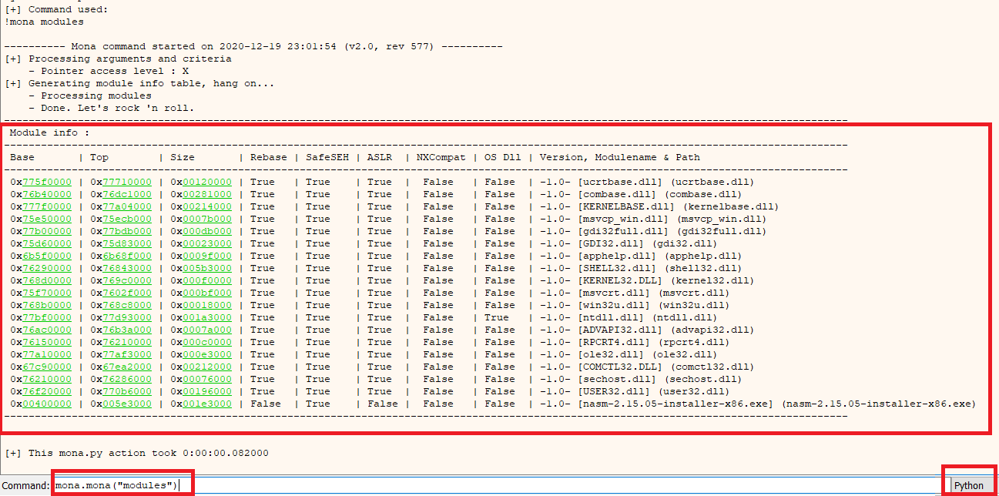

# x64dbg-exploiting
Do you want to use x64dbg instead of immunity debugger for your buffer overflow task?

Just download: 

https://github.com/David-Reguera-Garcia-Dreg/x64dbg-exploiting/releases/download/1.0/x64dbg-exploitingv1.0.zip

**WARNING:** Use ASCII PATHs for installation of all things. If these README-steps dont works for you, try use my paths

unzip in a ASCII PATH folder (I use: C:\x64dbg-exploitingv1.0)

Install python-2.7.11.msi (I use C:\Python27\)

Install python-2.7.11.amd64.msi (I use C:\Python27x64\)

Set ENV PYTHON PATH in installation:


Done!

Try it!

Open x64dbg-exploitingv1.0\x64dbg\release\x32\x32dbg.exe 

Open x64dbg-exploitingv1.0\x64dbg\release\x64\x64dbg.exe 

File -> Open -> Debug an executable

Go to Log, select **Python** in command line

Write in command line:

import mona

mona.mona("module")




mona.mona("help") 

mona.mona("help command")

```
Available commands and parameters :

? / eval             | Evaluate an expression
assemble / asm       | Convert instructions to opcode. Separate multiple instructions with #
bpseh / sehbp        | Set a breakpoint on all current SEH Handler function pointers
breakfunc / bf       | Set a breakpoint on an exported function in on or more dll's
breakpoint / bp      | Set a memory breakpoint on read/write or execute of a given address
bytearray / ba       | Creates a byte array, can be used to find bad characters
calltrace / ct       | Log all CALL instructions
compare / cmp        | Compare contents of a binary file with a copy in memory
config / conf        | Manage configuration file (mona.ini)
copy / cp            | Copy bytes from one location to another
deferbp / bu         | Set a deferred breakpoint
dump                 | Dump the specified range of memory to a file
egghunter / egg      | Create egghunter code
encode / enc         | Encode a series of bytes
filecompare / fc     | Compares 2 or more files created by mona using the same output commands
find / f             | Find bytes in memory
findmsp / findmsf    | Find cyclic pattern in memory
findwild / fw        | Find instructions in memory, accepts wildcards
fwptr / fwp          | Find Writeable Pointers that get called
geteat / eat         | Show EAT of selected module(s)
getiat / iat         | Show IAT of selected module(s)
getpc                | Show getpc routines for specific registers
gflags / gf          | Show current GFlags settings from PEB.NtGlobalFlag
header               | Read a binary file and convert content to a nice 'header' string
heap                 | Show heap related information
help                 | show help
hidedebug / hd       | Attempt to hide the debugger
info                 | Show information about a given address in the context of the loaded application
infodump / if        | Dumps specific parts of memory to file
jmp / j              | Find pointers that will allow you to jump to a register
jop                  | Finds gadgets that can be used in a JOP exploit
kb / kb              | Manage Knowledgebase data
modules / mod        | Show all loaded modules and their properties
noaslr               | Show modules that are not aslr or rebased
nosafeseh            | Show modules that are not safeseh protected
nosafesehaslr        | Show modules that are not safeseh protected, not aslr and not rebased
offset               | Calculate the number of bytes between two addresses
pageacl / pacl       | Show ACL associated with mapped pages
pattern_create / pc  | Create a cyclic pattern of a given size
pattern_offset / po  | Find location of 4 bytes in a cyclic pattern
peb / peb            | Show location of the PEB
rop                  | Finds gadgets that can be used in a ROP exploit and do ROP magic with them
ropfunc              | Find pointers to pointers (IAT) to interesting functions that can be used in your ROP chain
seh                  | Find pointers to assist with SEH overwrite exploits
sehchain / exchain   | Show the current SEH chain
skeleton             | Create a Metasploit module skeleton with a cyclic pattern for a given type of exploit
stackpivot           | Finds stackpivots (move stackpointer to controlled area)
stacks               | Show all stacks for all threads in the running application
string / str         | Read or write a string from/to memory
suggest              | Suggest an exploit buffer structure
teb / teb            | Show TEB related information
unicodealign / ua    | Generate venetian alignment code for unicode stack buffer overflow
update / up          | Update mona to the latest version

<b>Want more info about a given command ?  Run !mona help <command></b>
```

# CREDITS

* https://x64dbg.com/
* https://github.com/x64dbg/mona
* https://github.com/x64dbg/x64dbgpy
* https://github.com/x64dbg/x64dbgpylib

# CONTRIBUTORS

* nobody loves me
